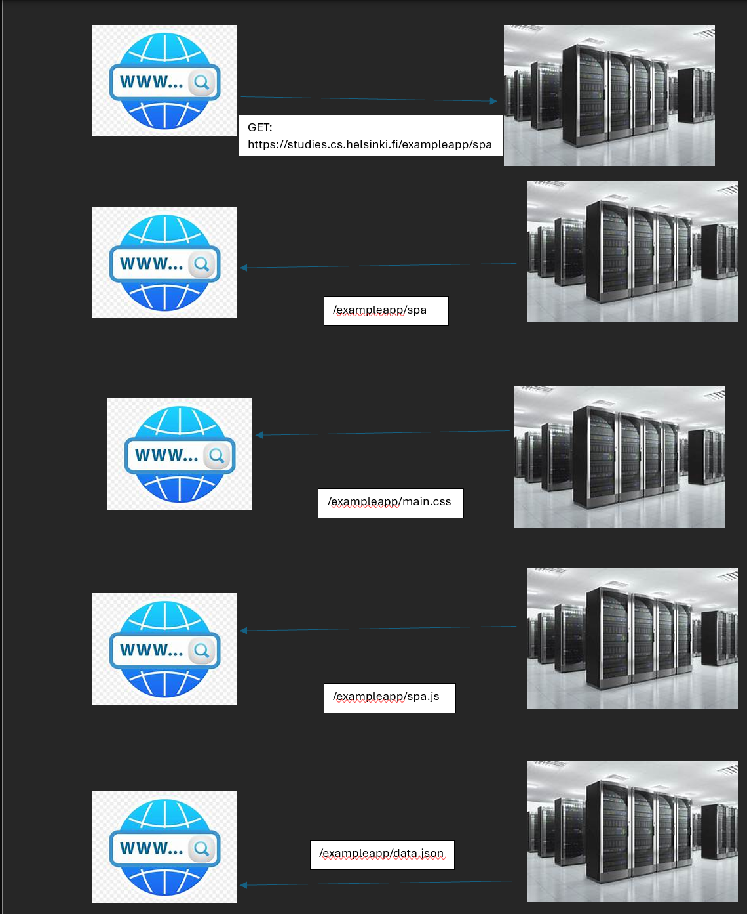

browser asks for the link the user has attempted to access (GET: https://studies.cs.helsinki.fi/exampleapp/spa)

server gives the list and the associated files all from the single page on the url above to the browser

GET: https://studies.cs.helsinki.fi/exampleapp/main.css

GET: https://studies.cs.helsinki.fi/exampleapp/main.js

GET: https://studies.cs.helsinki.fi/exampleapp/data.json

