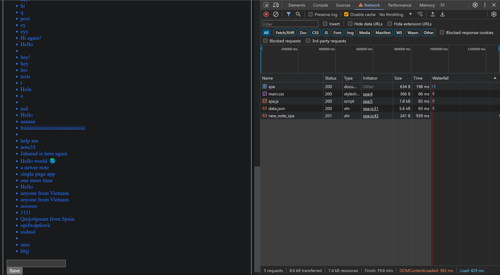
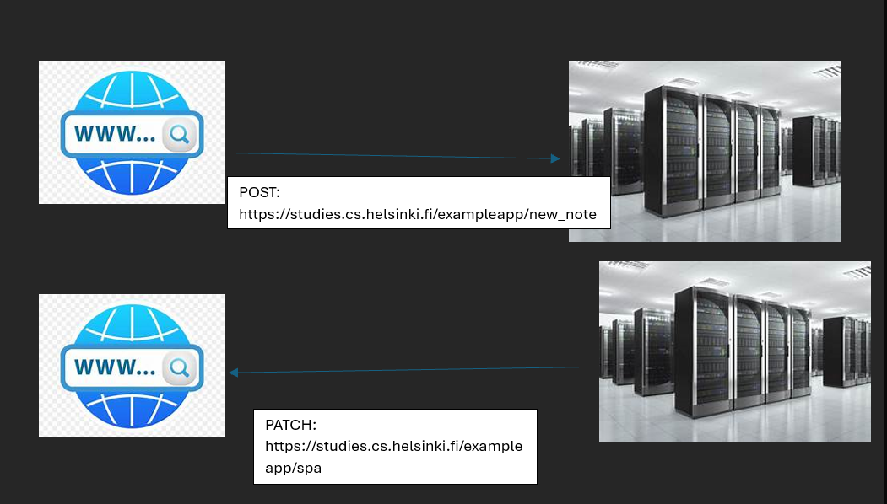

browser posts comment to server

server receives a http 201 patch code to say the list has been updated on the server

the browser is sent the updated data.json of all the comments along with the same .js/css files

browser POST: https://studies.cs.helsinki.fi/exampleapp/new_note

server patch: https://studies.cs.helsinki.fi/exampleapp/spa

